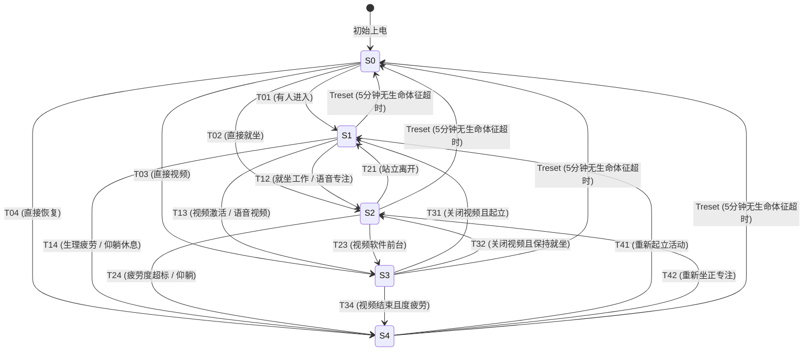

# 💡 基于多模态感知与有限状态机 (FSM) 的智能建筑照明控制系统

本系统是一项面向未来智能建筑的健康照明与环境控制系统。通过融合多模态传感器（PIR、超声波、毫米波雷达、ToF、脑电波 EEG 等）的实时数据流，配合高度严谨的 **有限状态机 (Finite State Machine, FSM)**，系统能够精准识别空间占用、人员姿态与生理状态，自动在不同的典型场景之间进行无缝切换。同时，系统融合了人因工程学（Circadian Lighting）的调光曲线，实现“以人为本”的动态健康干预。

仓库 URL：https://github.com/GSY707/light-fsm-learning-demo.git

---

## 📌 1. 当前光照控制现状与行业痛点

传统建筑照明控制系统（如基于时间表或简单感应器的控制）已暴露出诸多局限，难以满足现代多功能空间对视觉舒适度、能效及光健康的个性化需求：

* ❌ **“人到灯亮，人静灯灭”的误关痛点（False-Off）**：传统的被动红外（PIR）传感器只能检测大范围移动。当使用者在桌前静坐办公、阅读或小憩时，传感器因无热释电脉冲而漏报，导致灯光被错误熄灭，迫使人频繁招手或起立重新唤醒。
* ❌ **单一传感器的误开痛点（False-On）**：超声波传感器虽然对微动敏感，但易受到空调气流、飞虫或门窗微风的干扰而触发误动作，造成巨大的建筑电能浪费。
* ❌ **调光生硬且违背视觉感知（Weber-Fechner Law）**：普通灯光开关或线性调光没有考虑人眼非线性的视觉适应过程（对低亮度变化极敏感，对高亮度相对迟钝），瞬间跳变极易引发瞳孔骤缩、眩光感及视觉疲劳。
* ❌ **非视觉效应（NIF）缺失与生物节律失调**：静态色温与照度无法配合人类视网膜 ipRGCs 神经细胞的感知，导致室内办公人员褪黑素与皮质醇分泌紊乱，诱发工作疲劳、失眠或季节性情绪障碍（SAD）。
* ❌ **信息孤岛与设备冲突**：照明、电动百叶窗、暖通空调（HVAC）和视频会议软件之间缺乏协同。例如，白天强烈的侧向自然光常导致摄像头反光或眩光，而系统不会主动拉下窗帘并补充面部漫射光。

---

## 🚀 2. 本系统做出的核心升级

针对上述痛点，本项目通过跨学科重构，实现了以下五大技术升级：

1. **多模态传感器级联融合（Multi-modal Fusion）**：
   结合 **ToF (飞行时间) 3D 深度点云**（实现无隐私泄露的人员计数与站立/就坐姿态判定）、**毫米波雷达**（心跳与呼吸级静止存在检测）以及 **PIR/双鉴技术**，辅以 **EEG (脑电波) 疲劳数据接口**，彻底消除了探测盲区和漏报误报。
2. **确定性 Moore 型有限状态机 (FSM) 决策引擎**：
   照明控制逻辑被严格规约为 Moore 型 FSM，输出状态（CCT、各通道照度）完全由当前状态节点决定，确保了光环境的稳定性和抗扰性。同时通过有向边布尔代数计算（逻辑与/或，结合时间迟滞）实现高可靠性切换，消除传统大语言模型（LLM）直接控制时的“幻觉”、延迟与高错误率。
3. **四维独立光照矩阵 (Four-Dimensional Lighting Matrix)**：
   解耦传统单一光源，将空间光场划分为四个逻辑控制通道：
   * **环境光 (Ambient)**：顶部漫射，提供寻路与柔和底光，洗墙面以减缓对比度。
   * **任务光 (Task)**：窄发光角聚焦桌面，高照度高色温（达6500K），抑制褪黑素，拉升专注度。
   * **面部补光 (Facial Fill)**：偏置柔光，消除眼窝与下颌阴影，专为数字视频会议摄像优化。
   * **情境光 (Accent)**：踢脚线与陈设氛围渲染（RGB-CW），平抚焦虑，引导副交感神经活动。
4. **过渡动力学与非线性调光（Weber-Fechner Curve）**：
   系统底层植入对数/平方律调光插值算法，在状态跃迁时执行非线性平滑过渡。根据场景定制转换时间（如紧急疏散 0s 强切，进入唤醒 0.5-2.5s 拉升，睡眠/节律恢复 3s 至 30min 慢降），完美呵护人眼暗适应与明适应。
5. **AI 辅助设计与生成式空间视觉重构**：
   结合大语言多模态自回归模型 **Nano Banana 2**，实现根据场景意图自动推理空间阻挡、材质粗糙度（PBR）和光线物理反射，生成具有高度物理真实感的光照渲染底图。

---

## 🎨 3. 典型场景效果展示 (`fsm-demo/images`)

以下利用生成式 AI (Nano Banana 2) 重构的五个智能居家办公空间 (Home Office) 典型状态，直观展示光环境的物理变化与人因工程设计：

### 📁 S₀ 空闲待机 (Vacant)
> [!NOTE]
> **状态特性**：CCT 2700K | 全局照度 < 10 Lux | 功耗最小化。
>
> 空间处于无人占用待机状态，主照明全部关闭。仅在踢脚线隐蔽处亮起微弱的 2700K 暖琥珀色脚灯，提供极低流明以维持空间轮廓可视性，防止夜间进入时发生跌倒等安全事故。
>
> 

### 📁 S₁ 环境引入 (Entry)
> [!NOTE]
> **状态特性**：CCT 4000K | 全局泛光 250 Lux | 视觉过渡缓冲。
>
> 检测到开门或人员走动，天花板回型漫反射暗槽灯带亮起 50% 亮度，桌面任务灯保持低位或关闭。均匀的中性漫射光柔和照亮几何界面，提供视觉导航，缓冲人眼暗适应。
>
> 

### 📁 S₂ 深度专注 (Focus)
> [!NOTE]
> **状态特性**：CCT 6500K | 桌面照度 1000 Lux | 生物警觉性干预。
>
> ToF 识别人员在书桌前就坐，系统启动专注模式。6500K 强冷白光精准投射于笔记本和键盘工作面，抑制褪黑素。周围环境光调暗（30%），构建强烈的亮度对比，在视觉心理上形成“隧道视野”以阻隔外界干扰。
>
> 

### 📁 S₃ 数字展示 (Video Call)
> [!NOTE]
> **状态特性**：CCT 4000K | 补光 85% & 氛围 40% | 物理-数字协同。
>
> 电脑启动摄像头或前台运行视频会议软件。桌面挂灯与侧板柔光箱开启（4000K），平滑消除面部结构阴影。背景暗色吸音板投射低饱和度的冷青色/暖金色氛围，智能百叶窗关闭至 70% 遮挡直射日光。
>
> 

### 📁 S₄ 节律恢复 (Relax)
> [!NOTE]
> **状态特性**：CCT 3000K | 全局照度 80 Lux | 副交感神经干预。
>
> 脑电波 EEG 检测到严重疲劳（疲劳度 >=75%）或 ToF 判定坐姿靠椅后仰。系统关闭顶部刺眼强光，转为低位反射落地灯和书架氛围灯慢速渲染。暖色低流明光谱模拟黄昏落日，诱导褪黑素分泌，强力辅助视觉与身心卸载。
>
> 

---

## 🗺️ 4. 状态节点 (Nodes) 与有向边 (Edges) 转移矩阵

系统的控制引擎基于以下定义好的稳态节点与有向转换边运行：

### 状态节点定义 (State Nodes)

| 状态 ID | 状态定义名称 | 色温 (CCT) | 全局照度 | 环境光通道 | 任务光通道 | 面部补光通道 | 情境光通道 | 空间状态与核心支持 |
| :---: | :---: | :---: | :---: | :---: | :---: | :---: | :---: | :--- |
| **S0** | 空间空闲 (Vacant) | 2700K | < 10 Lux | 2% | 0% | 0% | 0% | 无人占用，系统待机，脚灯维持轮廓 |
| **S1** | 环境引入 (Entry) | 4000K | 250 Lux | 50% | 5% | 0% | 0% | 人员刚进入，顶部泛光洗墙，视觉缓冲 |
| **S2** | 深度专注 (Focus) | 6500K | 1000 Lux | 15% | 100% | 0% | 0% | 就坐工作，台面聚光抑制褪黑素，隧道视野 |
| **S3** | 数字展示 (Video) | 4000K | 500 Lux | 20% | 10% | 85% | 40% | 开启视频应用，正面柔光面部补光，背景氛围 |
| **S4** | 节律恢复 (Relax) | 3000K | 80 Lux | 10% | 0% | 0% | 25% | EEG 疲劳/仰躺，低位黄昏暖光放松干预 |

### 有向边与触发逻辑 (Transitions)

状态转移遵循严格的传感器状态和时间序列的布尔逻辑公式：

#### 转移条件与动态参数详细说明：

* 🔔 **T01 (S0 ➔ S1) 有人进入**
  * **触发条件**: `(PIR || Door || Radar) && Posture !== 'seated' && Posture !== 'reclined' && !VideoApp`
  * **动态参数**: 0.5 秒极速非线性淡入。确保人踏入瞬间前方已被照亮，防跌防撞。
* 🔔 **T02 (S0 ➔ S2) 直接就坐**
  * **触发条件**: `Posture === 'seated' || VoiceCmd === 'focus'`
  * **动态参数**: 2.0 秒平滑聚焦渐变。任务灯缓慢爬升，给瞳孔收缩反应时间。
* 🔔 **T03 (S0 ➔ S3) 直接视频**
  * **触发条件**: `VideoApp || VoiceCmd === 'video'`
  * **动态参数**: 1.5 秒交叉淡入。同步拉下智能遮光百叶窗。
* 🔔 **T04 (S0 ➔ S4) 直接恢复**
  * **触发条件**: `Posture === 'reclined' || EEG >= 75`
  * **动态参数**: 3.0 秒暖光舒缓淡入。
* 🔔 **T12 (S1 ➔ S2) 就坐工作**
  * **触发条件**: `Posture === 'seated' || VoiceCmd === 'focus'`
  * **动态参数**: 2.0 秒聚焦渐变，照度攀升，色温由 4000K 向 6500K 移动。
* 🔔 **T13 (S1 ➔ S3) 视频激活**
  * **触发条件**: `VideoApp || VoiceCmd === 'video'`
  * **动态参数**: 1.5 秒面部补光开启，配合百叶窗物理遮光。
* 🔔 **T14 (S1 ➔ S4) 生理疲劳**
  * **触发条件**: `EEG >= 75 || Posture === 'reclined'`
  * **动态参数**: 3.0 秒舒缓退色渐变。
* 🔔 **T21 (S2 ➔ S1) 站立离开**
  * **触发条件**: `(Posture === 'standing' || Posture === 'none') && !VideoApp && EEG < 75 && (PIR || Radar)`
  * **动态参数**: 2.0 秒退焦渐变，从极亮桌面区平滑过渡到天花板环境泛光。
* 🔔 **T23 (S2 ➔ S3) 工作中开启会议**
  * **触发条件**: `VideoApp || VoiceCmd === 'video'`
  * **动态参数**: 1.0 秒极速平滑交叉渐变，减少视觉工作打断感。
* 🔔 **T24 (S2 ➔ S4) 专注疲劳干预**
  * **触发条件**: `EEG >= 75 || Posture === 'reclined'`
  * **动态参数**: 4.0 秒超长舒缓渐变，以极其轻柔的速度将蓝光抽离，注入低位红黄波段。
* 🔔 **T31 (S3 ➔ S1) 会议结束起立**
  * **触发条件**: `!VideoApp && (Posture === 'standing' || Posture === 'none') && (PIR || Radar)`
  * **动态参数**: 1.5 秒淡退补光，恢复常规环境泛光。
* 🔔 **T32 (S3 ➔ S2) 会议结束保持就坐**
  * **触发条件**: `!VideoApp && Posture === 'seated'`
  * **动态参数**: 2.0 秒平滑恢复。关闭垂直面部灯，重新拉升桌面冷白聚光。
* 🔔 **T34 (S3 ➔ S4) 会议结束度疲劳**
  * **触发条件**: `!VideoApp && (EEG >= 75 || Posture === 'reclined')`
  * **动态参数**: 3.0 秒退色转入节律恢复。
* 🔔 **T41 (S4 ➔ S1) 结束休息起立**
  * **触发条件**: `Posture === 'standing' && EEG < 75 && (PIR || Radar)`
  * **动态参数**: 2.0 秒平滑淡入至正常 Entry 环境光。
* 🔔 **T42 (S4 ➔ S2) 重新工作**
  * **触发条件**: `(Posture === 'seated' || VoiceCmd === 'focus') && EEG < 75`
  * **动态参数**: 2.5 秒爬升渐变，将使用者重新带入高效专注视野。
* 🔒 **Treset (任意活跃态 ➔ S0) 全局复位**
  * **触发条件**: `!PIR && !Door && !Radar && Posture === 'none'` 且持续时间超过 **5 分钟 (时滞延时 Hysteresis Delay)**。
  * **动态参数**: 2.0 秒缓慢淡出至 0%（仅保留 2% 踢脚线微光）。防止因人员处于监控盲区或沉思静坐而引发突发性黑暗。

---

## 🔒 5. 高优先级手动覆盖与自适应学习机制

为避免自动化控制序列与使用者的主观意志发生冲突，系统在 FSM 顶层设计了冲突调节机制：

### 1. 手动覆盖机制 (Manual Override)
* **硬中断**：当系统处于任意自动运行态时，一旦检测到物理墙面开关、手机 APP 调光条拉动或接收到特定的明确语音输入（如 “我要关闭所有灯光”），状态机立刻中断当前逻辑解析。
* **锁定手动状态 $S_{override}$**：系统强制切入手动锁定态，**冻结**所有来自毫米波雷达、ToF 及 PIR 触发的有向边转换，避免自动算法强行将灯光调回而与用户的实时操作“打架”。
* **退出与重同步 (Re-sync)**：一旦监测到人员完全离开防区，且超时时间达到 15 分钟待机阈值，系统自动释放死锁并执行 $T_{reset}$ 关灯退出。当下一次有人重新进入时，系统重新同步回基础自动运行逻辑。

### 2. 超时自适应机器学习
* **假阴性惩罚**：若系统因为超时达到触发条件将灯光关闭，但在随后的 30 秒内（用户还在室内但因之前完全静止被漏报），传感器重新捕获了微动或门窗开启，系统自适应强化学习模块将记录此次“不愉快事件”。
* **参数自调整**：后台在下一个循环中，会自动将该时段的静态超时阈值（Timeout Threshold）延长（例如从 5 分钟自适应调整至 10 分钟），提升系统的动态信任度。

---

## 🔮 6. 深入研究方向的理论展望

未来，本智能照明项目将以本阶段确立的 FSM 模型为地基，向以下两个高维方向推进：

### 1. 生理计算级光健康（Circadian / EML Modeling）
引入 **等效黑视素照度 (Melanopic Lux, EML)** 作为算法核心权重，不再采用单纯的物理 Lux。通过 GPS 地理信息与当地实时天文钟，构建针对个人非视觉效应（NIF）调制的动态光谱配方。在午后提供蓝光增强补偿以提神，在黄昏加速蓝光抽离模拟大气散射，以医学级非侵入手段调理人体褪黑素节律。

### 2. 泛在建筑物联网跨系统联动（IoT Synergy & Agentic AI）
* **异构子系统动态协同**：基于 BACnet/DALI-2 协议，照明系统所采集的 ToF 人数点云与毫米波生命微动数据，可实时上报给楼宇管理系统（BMS），进而控制暖通空调（HVAC）的通风量（按需通风 DCV）及外立面遮阳百叶的卷扬偏置角度。
* **意图驱动的大模型智能体 (LLM Agent)**：在中央控制单元部署如 `Gemma 4` / `Claude` 等微型边缘大模型，用户仅需说出 “我需要在安静暖和的环境下进行一次专业汇报”，Agent 会自主将其规划、拆解为窗帘闭合 80%、环境灯 20%、面部补光 85%、暖通温度设为 24℃ 的多设备协同控制序列。

---

## 💻 7. 交互式可视化系统 (`fsm-demo`) 使用说明

项目子文件夹 `fsm-demo` 提供了一个完整的交互式网页，用于展示上述状态机的运行逻辑。

### 🖥️ 系统文件结构
* [index.html](/fsm-demo/index.html)：可视化应用的主界面结构，包含 SVG 房间光效仿真区、FSM 拓扑图解区、传感器模拟区以及 FSM 决策控制链实时分析卡片。
* [app.js](/fsm-demo/app.js)：核心 FSM 引擎逻辑、传感器信号处理器以及 UI 渲染控制器。
* [style.css](/fsm-demo/style.css)：基于 Vanilla CSS 编写的暗黑高保真视觉渲染系统。

### 🕹️ 使用指南
1. 双击或使用浏览器打开 [index.html](/fsm-demo/index.html)。
2. **手动模拟传感器**：在左侧“📡 传感器模拟”面板中，自由勾选或调整参数（如勾选“PIR”，切换“ToF 姿态”为伏案就坐，或拖动“EEG 疲劳指数”至 80%），右侧的 FSM 状态机将触发对应的有向边转换，并动态演示流光特效。
3. **查看控制链推演**：中间的“🧠 FSM 决策控制链实时分析”卡片会分四步实时展示系统的推演过程：
   $$\text{触发传感器信号 (Signals)} \rightarrow \text{传感器状态解析 (State)} \rightarrow \text{设计光照状态 (Goal)} \rightarrow \text{目标输出与时间 (Outputs)}$$
4. **灯具通道映射**：切换到“🔌 灯饰通道对照”选项卡，悬停在四维逻辑通道卡片上，上方 SVG 房间中对应的物理灯具将产生高亮闪烁，帮助建立控制逻辑与物理设备之间的物理映射。
5. **自动演示**：点击右上角的“▶ 自动演示”按钮，系统将自动回放一段完整的一天行为序列（Vacant ➔ Entry ➔ Focus ➔ Video ➔ Relax ➔ Vacant），并在底部伴有旁白解说。
